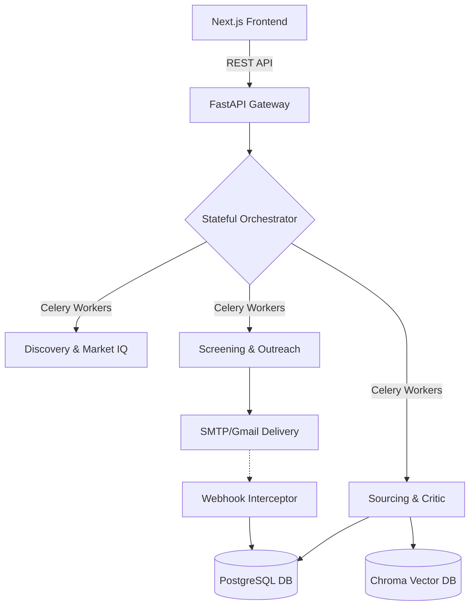

<div align="center">
  
  <h1>DVT Talent AI</h1>
  <p><strong>Enterprise-Grade Autonomous Recruitment Swarm & Copilot</strong></p>
  
  <p>
    
    
    
    
  </p>
</div>

---

DVT Talent AI is a production-ready, full-stack platform that completely automates the recruitment pipeline using a specialized swarm of 5 asynchronous AI Agents. It features two execution modes: a **Fully Autonomous Swarm** for high-volume outreach, and a **Stateful Copilot** containing human-in-the-loop (HITL) checkpoints to ensure absolute quality and brand safety.

## 🚀 Key Features

* **Multi-Agent Architecture (Lean-SaaS):**
  * **Market IQ & Discovery:** Analyzes real-time macroeconomic trends and generates optimized, high-converting job descriptions.
  * **Sourcing Agent:** Globally scrapes and verifies candidates using advanced fallbacks (Source-Hopping) via Web, GitHub, Dice, and internal DBs.
  * **Logic Critic (Audit):** Evaluates sourcing results to prevent AI hallucinations.
  * **Screening Agent:** Multi-modal ranking engine that scores resumes, detects propensity to leave, and runs video sentiment analysis.
  * **Outreach Agent:** Drafts custom micro-sites and personalized emails dynamically linked to the candidate's psychometrics.
* **Hybrid Execution Mechanics:**
  * **Autopilot:** "Fire-and-forget" massive autonomous pipelining.
  * **Copilot (HITL):** Stateful pipeline pauses. Agents enter an `AWAITING_INPUT` state natively via Celery, waiting for a human recruiter to manually approve Job Descriptions and Candidate lists via the dashboard.
* **Closed-Loop Communications:** 
  * Direct Gmail/SMTP delivery coupled with dynamic Webhook-intercept architecture to track open/reply metrics directly into the database.
* **Enterprise Security & Scale:** 
  * Built-in multi-tenancy at the Vector (Chroma) and Relational (PostgreSQL) layers. AES-256 encryption secures candidate Personally Identifiable Information (PII).

## 🏗️ Architecture



## 🛠️ Tech Stack

### **Backend**
* **Framework:** FastAPI (Python)
* **Asynchronous Engine:** Celery + Redis
* **Databases:** PostgreSQL (SQLAlchemy Async), ChromaDB (Vector Search)
* **AI Tooling:** OpenAI (GPT-4o), DeepSeek (Logic Routing), Langchain
* **Security:** Fernet standard AES-256 encryption.

### **Frontend**
* **Framework:** Next.js (React)
* **Styling:** Tailwind CSS + Framer Motion
* **State Management:** TanStack React Query

## 💻 Getting Started (Local Development)

### 1. Requirements
* Docker Desktop installed and running
* Node.js v18+
* Python 3.10+

### 2. Backend Setup
```bash
cd backend
python -m venv venv
source venv/bin/activate  # Or `venv\Scripts\activate` on Windows
pip install -r requirements.txt
```
*Note: Duplicate `.env.example` to `.env` and fill in your API keys (OpenAI, DeepSeek, Gmail App Passwords, etc).*

### 3. Frontend Setup
```bash
cd frontend
npm install
# Rename .env.example to .env
npm run dev
```

### 4. Booting the Infrastructure (Docker)
Ensure your backing services (Postgres, Redis) are online.
```bash
docker-compose up -d
```
The application will safely map to `http://localhost:3000` for the dashboard and `http://localhost:8000` for the API swagger docs.

## 🛡️ Trust & Brand Safety
Unlike traditional "Black Box" AI tools, DVT Talent AI prioritizes brand safety. The inclusion of the **Critic Agent** minimizes hallucinated sourcing matches, while the **Copilot** architecture puts legal liability back into the hands of the recruiter via hard "Approve" gates before an email is physically dispatched. 

## 📄 License
Proprietary Core. DO NOT redistribute without express permission.
